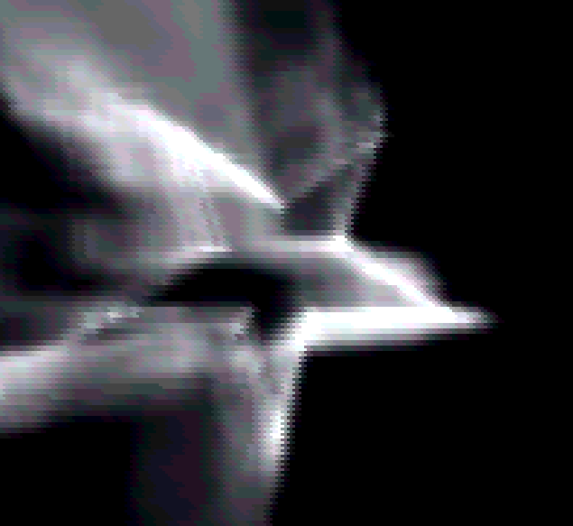
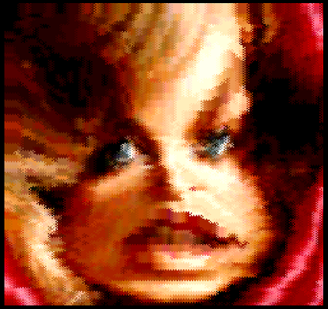
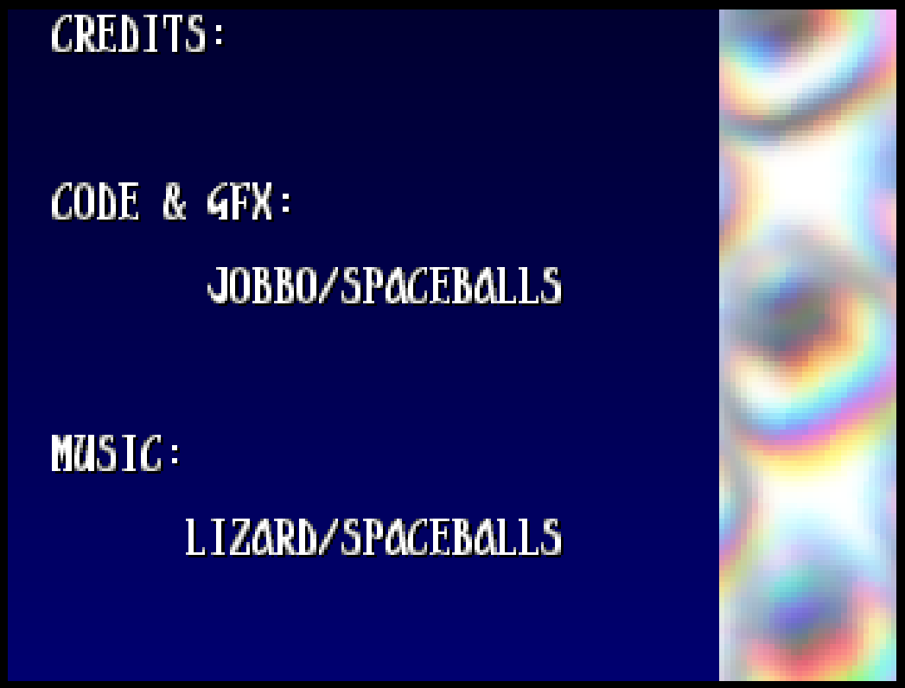
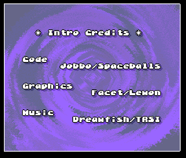
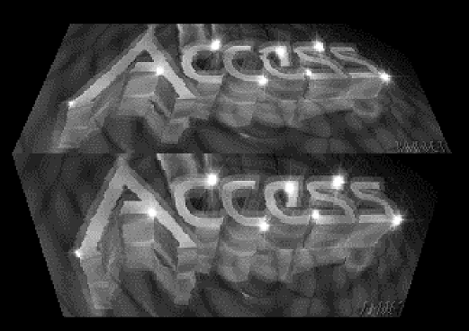
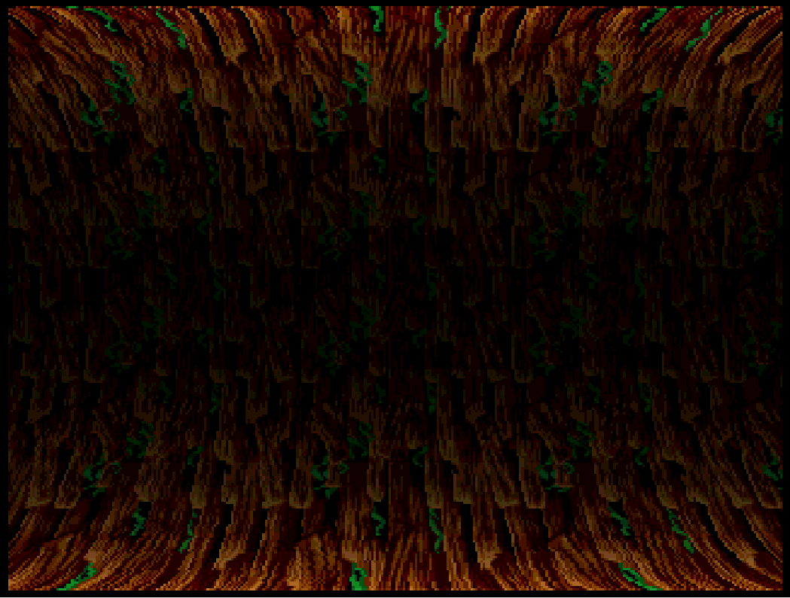

# Old-Jobbo-Amiga-Code

This is a collection of Amiga demo routines lifted from my old A1200.

Most are from around 1995-97, there are two intros in here along with lots of unfinished effects.

These were originally assembled using Devpac3, that still works for me in the emulator.

Some of the effects:

